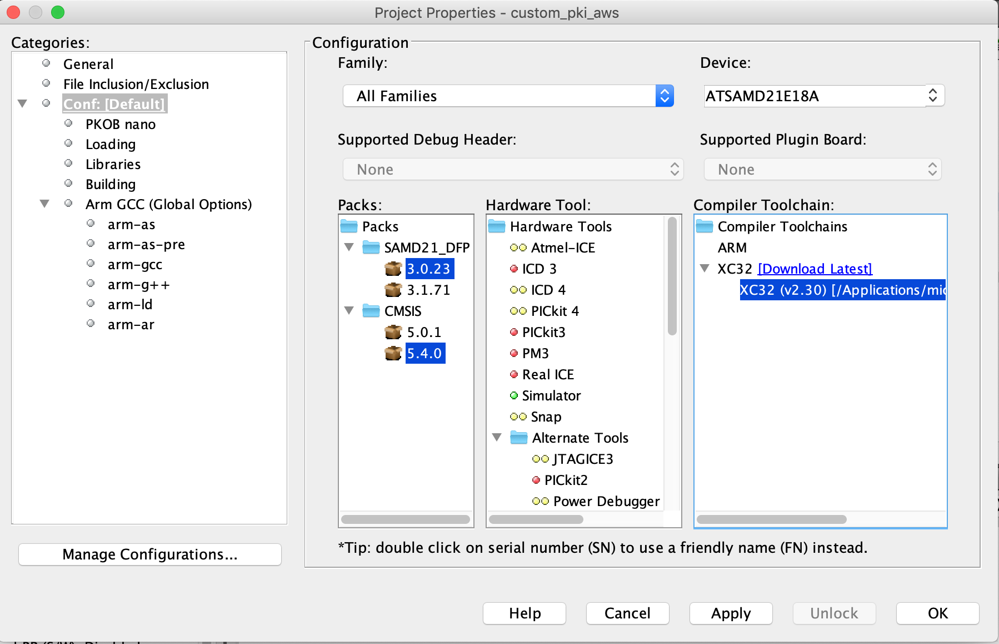
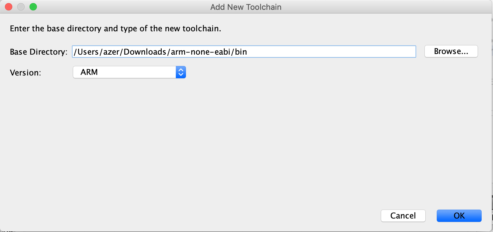

# Lab 2

This workshop is primarily driven by the documentation in the Microchip Trust Platform Design Suite located in trust_platform/DesignTools/Docs.  If there is any expansion or localized managed lab correction, it will be written here.

If you are running these steps in an unmanaged workshop capacity (in your own account) please implement the steps defined in the document **TrustFLEX_guide_AWS_demo_account_setup.pdf** before continuing.  In a managed workshop capacity this step has been done for you.

## Resource Generation

In this section, you will prepare the device resources for the ECC608A.

1. Open the document at `trust_platform/DesignTools/Docs/TrustFLEX Guide - AWS custom PKI.pdf`. For MAC users, this is located in your home directory.
2. Connect your kit to your workstation.
   1. Remove the kit from the box.
   2. Connect the USB cable to the computer and then connect the other end of the cable to the kit.
3. Make a serial connection to the kit.  Choose one of the following depending on your operating system.
   1. **WINDOWS**
      1. Open the program **TeraTerm** you installed in Lab 1.  You will see a dialog box similar to the following.

         

      2. Click the **Serial** radio button, and select the COM port labeled **Curiosity Virtual COM Port** and then click **OK**.

         

      3. On the menu, click **Setup** and then **Serial port...**.
      4. For Speed, select 115200 and then click **New setting**.  (older TeraTerm versions will ask you to click **OK**)

         
      5. Press the reset button on the device.  You should see output similar to the following.

         

         If you do not see this, or see garbage similar to the following,

         ```text
   (APP)(INFO)Chip ID 1503a0
          ```   

         you must [Reset the Image to the FACTORY IMAGE](https://microchipdeveloper.com/authentication:cryptoauth-factory-reset). **IMPORTANT** click the **ERASE** button prior to **PROGRAM** for best results.  After program, click the reset button on the device once more to ensure you see the expected results in the serial terminal window.

         Otherwise, continue to the next major step.
   2. **OSX**
      1. Open a new terminal window
      2. Execute the following command (your usbmodem may be different):
         ```console
         sudo cu -s 115200 -l /dev/cu.usbmodem141102
         ```
      3. If successful, you will see the text "Connected".

2. In the opened document, start with **Section 1**.  Select one of the following based on your operating system.
   1. **WINDOWS** To open the Navigator window, click the Windows **Start** icon, locate **Anaconda3 (64-bit)**, and click **Anaconda Navigator (trust_platform)**.
   2. **OSX** To open the Navigator window, click on Finder, locate the application **Anaconda-Navigator** and click to start.

## Section 4: Use Case Prototyping

   1. Follow Section 3 in the PDF.
   2. Follow Section 4.1 in the PDF.
   3. Follow Section 4.2 in the PDF.  Jump to Section 4.2.2 since we are using MPLAB X.

      After loading the project, you will receive an error in the Project Loading Error tab.

      

      Follow these steps to resolve.

      1. In the Projects tab, right-click the `custom_pki_aws` project, and select **Properties** which is the last option in the menu.
      
      3. Under Categories, click **Conf: [Default]**.  You will see there is an DFP load error under **Packs**.
         

      4. Click the **Resolve** Link. You will receive a pop-up box.  Click **Yes**.
         
         
      5. You might receive a pop-up box asking you to load the installed pack.  Click **Yes**.
         
      
      2. Under Categories, click **Conf: [Default]**.  You may find that you cannot select ARM in the section **Compiler Toolchain** on the right.
         
         
         1. If this is the case, first proceed to download the ARM toolchain compiler under the section **Arm GNU Toolchain for 32-bit Devices** located here https://www.microchip.com/mplab/avr-support/avr-and-arm-toolchains-c-compilers
         2. For MAC users, click on **MPLAB X IDE->Preferences**. Windows users click on **Tools->Options**.
         3. Click on the tab **Build Tools** under the Embedded section and click on the button **Add...**
            
         4. Click **Browse** and located the extracted toolchain downloaded. Select the **bin** directory and click **Ok**
            
         5. Proceed back to the **Properties** for the `custom_pki_aws` project and select ARM in the **Compiler Toolchain** section.
         6. Click **OK** to save changes.
         
   4. Follow the steps in section 4.2.2.

Congratulations! You have completed Lab 2!
